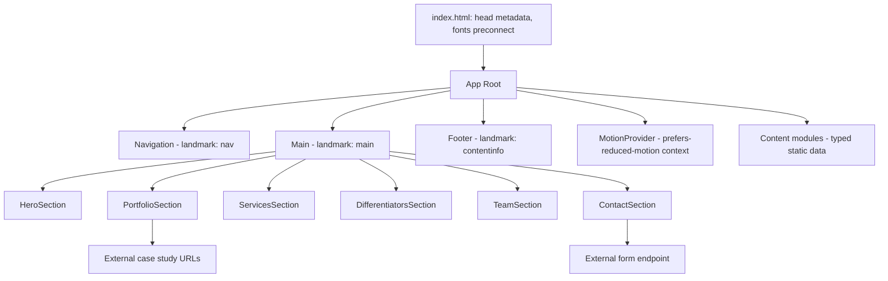
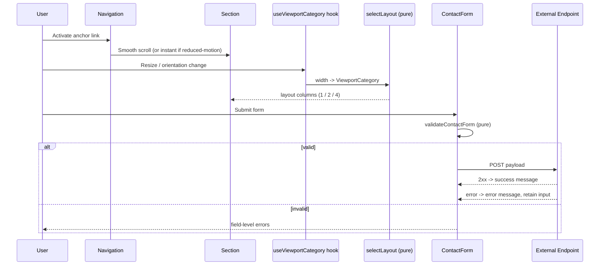

# Design Document

## Overview

The Ryze Portfolio Website is an award-quality, single-page marketing site for Ryze Technology, built as a static React application styled with Tailwind CSS. It renders seven content sections in a fixed vertical order (Hero, Featured Work, Services, Why Choose Ryze, Team, Contact CTA, Footer) with a sticky top navigation that provides smooth in-page anchoring.

The site has no server-side runtime. It is compiled into a static bundle (HTML, CSS, JS, and optimized image assets) deployable to any static host or CDN. The only network dependency at runtime is the Contact Form, which posts to a separately hosted endpoint that is fully decoupled from the static deployment.

The design is driven by three competing-but-reconcilable goals from the requirements:

1. **Visual excellence** — a dark-navy/cyan design system, tasteful scroll and hover animations, and a striking hero, targeted at Awwwards-level recognition.
2. **Strict performance budgets** — Lighthouse desktop performance >= 95, LCP <= 2.5s, CLS <= 0.1, achieved through code-splitting, lazy image loading, next-gen image formats, and layout-stable components.
3. **Inclusive access** — WCAG AA contrast, full keyboard operability, semantic landmarks, and a first-class `prefers-reduced-motion` experience.

This document defines the architecture, component decomposition, content data models, motion strategy, performance strategy, accessibility approach, and the correctness properties that pure logic (responsive layout selection, viewport precedence, form validation, meta-description truncation) must satisfy.

### Key Technical Decisions

| Decision | Choice | Rationale |
| --- | --- | --- |
| Build tooling | Vite + React + TypeScript | Fast static builds, first-class code-splitting, tree-shaking, and asset hashing for cache-busting. |
| Styling | Tailwind CSS | Required by stack; utility-first approach keeps the shipped CSS small and breakpoints declarative and consistent. |
| Animation | Framer Motion + IntersectionObserver | Declarative entrance/hover animation with built-in `prefers-reduced-motion` awareness; IntersectionObserver triggers entrance animations only when sections approach the viewport. |
| Content source | Static, typed TypeScript content modules | No CMS/runtime fetch needed; keeps the site fully static and the LCP fast. Content is import-time data validated against types. |
| Form transport | `fetch` POST to external endpoint | Satisfies the "separately hosted endpoint" constraint; the static site never owns the submission backend. |
| Image delivery | Build-time generated AVIF/WebP via `<picture>` | Meets next-gen format + fallback and lazy-load requirements while keeping layout shift at zero through explicit dimensions. |
| Document metadata | Static `index.html` head + build-time injection | Title, description, Open Graph, and canonical are present in the served HTML for crawlers and social scrapers without JS execution. |

## Architecture

### High-Level Structure

The application is a single route. There is no client-side router for the marketing page itself; navigation is anchor-based scrolling within one document. Case study detail destinations (Requirement 2.5) are external URLs or separate static pages opened from the cards, not in-app routes, which keeps the marketing bundle minimal.



### Layering

The codebase separates three concerns so that presentation, content, and pure logic evolve independently:

- **Presentation layer** — React components that render sections and cards. Components are intentionally "dumb": they receive content and layout decisions as props/hooks and render markup plus Tailwind classes.
- **Content layer** — Typed static data modules (`content/*.ts`) exporting case studies, services, differentiators, team members, site metadata, and section copy. This is the single source of truth for editable content.
- **Logic layer** — Pure, side-effect-free functions for the behaviors that vary with input and warrant property-based testing: responsive layout category selection, viewport-precedence resolution, contact-form validation, and meta-description truncation. These functions take primitive inputs and return primitive outputs, making them trivially testable in isolation from React.

This separation directly supports the testing strategy: the logic layer is unit- and property-tested without a DOM, while components are covered by example-based and snapshot tests.

### Rendering & Hydration Strategy

The site ships as a static HTML shell plus a hydrated React tree. The Hero section markup and critical CSS are inlined/prioritized so the largest contentful element paints quickly. Below-the-fold sections are present in the DOM for SEO and no-JS resilience, while heavier interactive enhancements (animation wiring, the contact form handler) hydrate progressively. Non-critical JavaScript (Framer Motion-driven sections beyond the hero) is code-split via dynamic import so the initial payload stays within the performance budget.

### Runtime Data Flow



## Components and Interfaces

### Component Tree

```
App
├── MotionProvider                (provides reducedMotion flag via context)
├── Navigation
│   ├── DesktopNav                (visible >= 768px)
│   └── MobileMenu                (toggleable < 768px)
├── main
│   ├── HeroSection
│   │   ├── HeroVisual            (illustration | gradient | video, motion-aware)
│   │   └── PrimaryCTA
│   ├── PortfolioSection
│   │   └── CaseStudyCard[]        (>= 2, placeholder-capable)
│   ├── ServicesSection
│   │   └── ServiceCard[4]
│   ├── DifferentiatorsSection
│   │   └── DifferentiatorItem[4]
│   ├── TeamSection
│   │   ├── TeamStory             (optional, 30–120 words when present)
│   │   └── TeamMemberCard[4]
│   └── ContactSection
│       └── ContactForm | ScheduleCallCTA
└── Footer
```

### Shared Hooks and Utilities

- **`useReducedMotion()`** — wraps the `prefers-reduced-motion: reduce` media query and exposes a boolean. All animated components consume this to choose between animated and final-state rendering (Requirements 1.8, 2.6, 3.5, 8.4, 11.2).
- **`useViewportCategory()`** — observes viewport width and returns a `ViewportCategory` (`mobile` | `tablet` | `desktop`) by delegating to the pure `selectViewportCategory(width)` function. Drives column counts and nav presentation.
- **`useSectionEntrance(ref)`** — wires an IntersectionObserver to a section ref and returns whether it has entered; combined with `useReducedMotion()` to gate entrance animations.
- **`smoothScrollToSection(id, reducedMotion)`** — performs `scrollInto, view` with `behavior: 'smooth'` unless reduced motion is active, in which case it uses `behavior: 'auto'` (Requirements 8.3, 8.4).

### Key Component Interfaces

```typescript
// Viewport classification
type ViewportCategory = 'mobile' | 'tablet' | 'desktop';

// Column layout result consumed by grid sections
type ColumnCount = 1 | 2 | 4;

// Navigation
interface NavLink {
  id: SectionId;          // anchor target
  label: string;
}
type SectionId =
  | 'hero' | 'portfolio' | 'services'
  | 'differentiators' | 'team' | 'contact';

interface NavigationProps {
  links: NavLink[];
  reducedMotion: boolean;
}

// Hero
type HeroVisualKind = 'illustration' | 'gradient' | 'video';
interface HeroContent {
  headline: string;        // "We build products that work forever"
  subheadline: string;     // "Websites. Apps. Systems. Designed to scale."
  visualKind: HeroVisualKind;
  cta: { label: 'See our work' | "Let's talk"; targetSection: SectionId };
}

// Case study card
interface CaseStudyCardProps {
  caseStudy: CaseStudy | null;   // null => placeholder mode (Req 2.3)
  reducedMotion: boolean;
  viewport: ViewportCategory;
}

// Contact form
interface ContactFormValues {
  name: string;
  email: string;
  message: string;
}
type FieldError = { field: keyof ContactFormValues; message: string };
type SubmitState =
  | { status: 'idle' }
  | { status: 'submitting' }
  | { status: 'success' }
  | { status: 'error'; retainedValues: ContactFormValues };

interface ContactFormProps {
  endpoint: string;        // separately hosted endpoint (Req 14.4)
  onValidate: (values: ContactFormValues) => FieldError[];
}
```

### Pure Logic Interfaces (Logic Layer)

```typescript
// Responsive category from raw width (Req 9, breakpoint precedence in 9.5)
function selectViewportCategory(widthPx: number): ViewportCategory;

// Column count per category for grid sections (Req 9.2–9.4)
function selectColumnCount(category: ViewportCategory): ColumnCount;

// Resolve category when multiple media queries match; smallest wins (Req 9.5)
function resolveViewportPrecedence(matches: ViewportCategory[]): ViewportCategory;

// Contact form validation (Req 6.3, 6.5, 6.6)
function validateContactForm(values: ContactFormValues): FieldError[];

// Email syntactic validity (Req 6.4, 6.6)
function isSyntacticallyValidEmail(email: string): boolean;

// Meta description normalization (Req 15.2, 15.3)
function normalizeMetaDescription(raw: string): string;

// Copyright year for footer (Req 7.1)
function currentCopyrightYear(now: Date): number;
```

## Data Models

All content is static, typed, and validated at the type level. Content modules export immutable arrays/objects consumed directly by components. There is no runtime persistence or database.

### Site Metadata

```typescript
interface SiteMetadata {
  title: string;              // must contain "Ryze Technology" (Req 15.1)
  description: string;        // >= 50 chars; truncated to <= 160 at build (Req 15.2, 15.3)
  canonicalUrl: string;       // production URL (Req 15.5)
  openGraph: {
    title: string;
    description: string;
    imageUrl: string;         // preview image (Req 15.4)
  };
}
```

### Case Study

```typescript
interface CaseStudyMetric {
  label: string;              // e.g. "Conversion uplift"
  value: string;              // e.g. "+38%"
}

interface CaseStudyImage {
  avifSrc: string;
  webpSrc: string;
  fallbackSrc: string;        // jpg/png fallback (Req 12.5)
  width: number;              // explicit dimensions prevent CLS (Req 12.3)
  height: number;
  alt: string;                // descriptive alt text (Req 13.3)
}

interface CaseStudy {
  id: string;
  projectName: string;        // (Req 2.2)
  industry: string;           // (Req 2.2)
  metrics: CaseStudyMetric[]; // at least one (Req 2.2)
  preview: CaseStudyImage;    // (Req 2.2)
  detailUrl: string;          // detail page or external live URL (Req 2.5)
}
```

A minimum of two case studies are authored (Req 2.1). When the source array is empty, the Portfolio section renders placeholder cards preserving structure without content (Req 2.3).

### Service

```typescript
type ServiceCategory =
  | 'Websites & Web Apps'
  | 'Mobile Apps'
  | 'Desktop Applications'
  | 'Business Systems & Automation';

interface Service {
  category: ServiceCategory;  // exactly the four categories (Req 3.2)
  iconName: string;           // icon identifier
  description: string;        // single sentence (Req 3.3)
}
```

The services array is fixed at exactly four entries, one per category (Req 3.1, 3.2).

### Differentiator

```typescript
type DifferentiatorTitle =
  | 'Complete ownership'
  | 'Full-stack expertise'
  | 'Long-term partnership'
  | 'Transparent process';

interface Differentiator {
  title: DifferentiatorTitle; // exactly the four titles (Req 4.2)
  description: string;        // short supporting description (Req 4.3)
}
```

Exactly four differentiators are authored (Req 4.1).

### Team Member and Team Story

```typescript
interface TeamMemberImage {
  avifSrc: string;
  webpSrc: string;
  fallbackSrc: string;
  width: number;
  height: number;
  alt: string;
}

interface TeamMember {
  name: string;               // (Req 5.2)
  role: string;               // (Req 5.2)
  photo: TeamMemberImage;     // (Req 5.2)
  initials: string;           // placeholder when photo fails (Req 5.5)
}

interface TeamContent {
  story?: string;             // optional; rendered only when present (Req 5.3, 5.4)
  members: TeamMember[];      // exactly four (Req 5.1)
}
```

The Team section renders even when `story` is absent or shorter than 30 words (Req 5.4). When present, authored stories are constrained to 30–120 words (Req 5.3). Image fallback degrades gracefully: photo → initials placeholder → reserved empty layout space (Req 5.5, 5.6).

### Contact and Footer

```typescript
interface ContactContent {
  headline: string;           // "Ready to build something great?" (Req 6.1)
  mode: 'form' | 'schedule';  // form or "Schedule a call" CTA (Req 6.2)
  endpoint?: string;          // required when mode === 'form' (Req 14.4)
  scheduleUrl?: string;       // required when mode === 'schedule' (Req 6.8)
}

interface FooterContent {
  companyName: 'Ryze Technology';     // (Req 7.1)
  navLinks: NavLink[];                // anchors to all six sections (Req 7.2)
  externalContacts: { label: string; href: string }[]; // >= 1 (Req 7.3)
}
```

### Design Token Model

```typescript
interface DesignTokens {
  colors: {
    backgroundNavy: string;   // dark navy primary background (Req 10.1)
    accentCyan: string;       // cyan accent for CTAs/emphasis (Req 10.2)
    bodyText: string;         // chosen for >= 4.5:1 contrast (Req 10.4)
  };
  typography: {
    bodyMobilePx: number;     // >= 16 (Req 10.3)
    bodyDesktopPx: number;    // >= 18 (Req 10.3)
  };
  layout: {
    minTapTargetPx: 44;       // (Req 9.6)
    mobileMaxPx: 767;
    tabletMaxPx: 1023;
  };
}
```

Color tokens are chosen so that body text against the navy background meets the 4.5:1 AA contrast ratio (Req 10.4) and large text / interactive boundaries meet 3:1 (Req 10.5). These ratios are verified during the testing phase with automated contrast checks against the resolved token values.

## Correctness Properties

*A property is a characteristic or behavior that should hold true across all valid executions of a system — essentially, a formal statement about what the system should do. Properties serve as the bridge between human-readable specifications and machine-verifiable correctness guarantees.*

The following properties apply to this feature's **pure logic layer**: responsive layout selection, viewport precedence resolution, scroll-behavior selection, contact-form validation, image rendering, meta-description normalization, and the footer copyright year. These functions have wide, meaningful input spaces and clear input/output behavior. Visual styling, animation timing, Lighthouse metrics, and static content presence are covered by example, integration, and smoke tests instead (see Testing Strategy).

### Property 1: Column count maps correctly per viewport category

*For any* `ViewportCategory`, `selectColumnCount` returns exactly 1 for `mobile`, 2 for `tablet`, and 4 for `desktop`, and never any other value.

**Validates: Requirements 2.7, 9.2, 9.3, 9.4**

### Property 2: Viewport category partitions the width axis

*For any* non-negative viewport width in CSS pixels, `selectViewportCategory` returns `mobile` when width < 768, `tablet` when 768 <= width < 1024, and `desktop` when width >= 1024; the function is monotonic across the boundaries (increasing width never moves from a larger category to a smaller one).

**Validates: Requirements 9.5**

### Property 3: Overlapping breakpoints resolve to the smallest matching category

*For any* non-empty set of matching `ViewportCategory` values, `resolveViewportPrecedence` returns the smallest category present under the ordering `mobile < tablet < desktop` (mobile takes precedence over tablet and desktop).

**Validates: Requirements 9.5**

### Property 4: Scroll behavior is smooth exactly when motion is allowed

*For any* boolean `reducedMotion` flag, the chosen scroll behavior is `'smooth'` if and only if `reducedMotion` is false, and `'auto'` (no smooth animation) when `reducedMotion` is true.

**Validates: Requirements 8.3, 8.4**

### Property 5: Contact form validation produces exactly the correct error set

*For any* `ContactFormValues`, `validateContactForm` returns an empty error list if and only if all required fields (name, message) are non-empty after trimming whitespace and the email is syntactically valid; otherwise it returns exactly one error for each empty required field and exactly one email error when the email is non-empty but syntactically invalid, and no spurious errors.

**Validates: Requirements 6.4, 6.5, 6.6**

### Property 6: Case study card renders all required fields and links to its destination

*For any* valid `CaseStudy`, the rendered Case_Study_Card contains the project name, the industry, at least one key metric, a preview image with a defined alt attribute, and an activation target whose href equals the case study's `detailUrl`.

**Validates: Requirements 2.2, 2.5**

### Property 7: Service card renders all required fields

*For any* valid `Service`, the rendered Service_Card contains an icon, the category title, and the single-sentence description.

**Validates: Requirements 3.3**

### Property 8: Team member card renders all required fields

*For any* valid `TeamMember`, the rendered Team_Member_Card contains the member's name, role, and a photo image element.

**Validates: Requirements 5.2**

### Property 9: Image rendering provides next-gen formats, a fallback, and alt text

*For any* image model, the rendered `<picture>` element contains an AVIF source, a WebP source, and a fallback `` element that carries a defined `alt` attribute.

**Validates: Requirements 12.5, 13.3**

### Property 10: Meta description normalization bounds length, preserves short input, and is idempotent

*For any* string input, `normalizeMetaDescription` returns a string of at most 160 characters; if the input is already at most 160 characters it is returned unchanged; and applying the function twice yields the same result as applying it once.

**Validates: Requirements 15.3**

### Property 11: Footer copyright year reflects the current year

*For any* `Date`, `currentCopyrightYear` returns that date's four-digit calendar year, and the rendered Footer displays that year alongside the company name.

**Validates: Requirements 7.1**

## Error Handling

### Contact Form Submission

The contact form is the only runtime I/O path. Its error handling is explicit and preserves user work:

- **Validation errors (client-side, pre-submit):** `validateContactForm` runs before any network call. Field-level errors are rendered adjacent to each offending input and associated via `aria-describedby` so assistive technology announces them (Requirements 6.5, 6.6). No request is sent while errors exist.
- **Network / server failure:** A failed `fetch` (rejected promise, timeout, or non-2xx response) transitions `SubmitState` to `{ status: 'error', retainedValues }`. The form displays a non-field error message indicating submission failed and **retains all entered values** so the user can retry without re-typing (Requirement 6.7).
- **Success:** A 2xx response transitions to `{ status: 'success' }`, which renders the confirmation message (Requirement 6.4). The handler enforces a perceived completion within 2 seconds via an optimistic state transition and a bounded request timeout.
- **In-flight state:** While `submitting`, the submit control is disabled and labelled busy (`aria-busy`) to prevent duplicate submissions.

### Image Loading Failures (Team and Portfolio)

Images degrade through a defined fallback chain:

1. Primary photo via `<picture>` (AVIF → WebP → fallback raster).
2. On `onError`, swap to an **initials placeholder** graphic (Requirement 5.5).
3. If the placeholder also fails to render, the card **reserves its layout space** (fixed aspect-ratio box) and shows no visual element, preventing layout shift (Requirements 5.6, 12.3).

### Content Absence

- **Empty portfolio:** When no case studies are available, the Portfolio section renders structural **placeholder cards** rather than collapsing, keeping the layout intact (Requirement 2.3).
- **Missing or short team story:** The Team section omits the story paragraph and renders the member grid normally; it never throws on absent/short story content (Requirement 5.4).

### Defensive Rendering

Content modules are typed, so malformed content is caught at build time rather than runtime. Components treat optional fields (team story, schedule URL) defensively and render valid markup regardless of which optional content is present.

## Testing Strategy

A dual approach combines property-based tests for universal logic with example, edge, integration, and smoke tests for everything else.

### Tooling

- **Test runner:** Vitest (integrates natively with Vite).
- **Component testing:** React Testing Library + jsdom.
- **Property-based testing:** `fast-check` (the standard PBT library for the TypeScript/JS ecosystem) — used, not reimplemented.
- **Accessibility:** `jest-axe`/`axe-core` for automated audits of contrast hints, labels, and landmarks.
- **Responsive/integration:** viewport-resized RTL tests asserting `scrollWidth <= clientWidth` and tab-order traversal.
- **Performance & build:** Lighthouse CI against the production build; static-artifact verification.

### Property-Based Tests

Each correctness property from the section above is implemented as a **single** property-based test running a **minimum of 100 iterations**. Each test is tagged with a comment referencing its design property using the format:

`// Feature: ryze-portfolio-website, Property {number}: {property_text}`

| Property | Function under test | Generators |
| --- | --- | --- |
| 1 | `selectColumnCount` | enum of `ViewportCategory` |
| 2 | `selectViewportCategory` | non-negative integers/floats spanning boundaries (incl. 0, 767, 768, 1023, 1024) |
| 3 | `resolveViewportPrecedence` | non-empty subsets of the category set |
| 4 | scroll-behavior selector | booleans |
| 5 | `validateContactForm` | records with arbitrary strings incl. empty/whitespace names/messages and valid/invalid emails |
| 6 | Case_Study_Card render | arbitrary `CaseStudy` (name, industry, >=1 metric, image, detailUrl) |
| 7 | Service_Card render | arbitrary `Service` |
| 8 | Team_Member_Card render | arbitrary `TeamMember` |
| 9 | image `<picture>` render | arbitrary image model |
| 10 | `normalizeMetaDescription` | arbitrary strings incl. lengths around 160, unicode, empty |
| 11 | `currentCopyrightYear` | arbitrary `Date` values across years |

Generators must exercise edge cases the prework flagged: boundary widths (767/768/1023/1024), whitespace-only field values, invalid email shapes, descriptions straddling the 160-character limit, unicode characters, and image models with varied source paths.

### Example-Based Unit Tests

Cover specific content and constrained behaviors that do not vary across a wide input space:

- Hero headline/subheadline/visual/CTA content and CTA scroll targets (Requirements 1.1–1.6).
- Exactly-four invariants for services, differentiators, and team (Requirements 3.1, 4.1, 5.1) and presence of the named categories/differentiators (Requirements 3.2, 4.2).
- Contact headline and form/schedule mode selection (Requirements 6.1, 6.2, 6.3, 6.8).
- Footer anchors and external contact link (Requirements 7.2, 7.3).
- Section order in the DOM (Requirement 8.1) and reduced-motion rendering states (Requirements 1.8, 2.6, 3.5, 11.2).
- SEO head: title text, Open Graph tags, canonical link, lazy-load attributes (Requirements 12.4, 15.1, 15.4, 15.5).

### Edge-Case Tests

- Empty portfolio placeholder rendering (Requirement 2.3).
- Missing/short team story (Requirement 5.4) and team-story word-count validity for authored content (Requirement 5.3).
- Image photo failure → initials, and double failure → reserved space (Requirements 5.5, 5.6).
- Network/server failure retains input and shows error (Requirement 6.7).
- Meta description minimum length for authored content (Requirement 15.2).

### Accessibility Tests

- `axe` audits for landmarks (nav/main/contentinfo), form label association, and image alt presence (Requirements 13.3, 13.4, 13.5).
- Focus-visible indicator presence and keyboard tab-order traversal in reading order (Requirements 13.1, 13.2).
- Computed contrast-ratio checks on resolved design tokens: >= 4.5:1 for body text and >= 3:1 for large text / interactive boundaries (Requirements 10.4, 10.5).

### Integration Tests

- Responsive layout at representative widths asserting no horizontal scroll (Requirement 9.1) and correct rendered column counts and nav presentation (Requirements 8.2, 8.5, 9.6).
- Contact form happy path against a mocked external endpoint, asserting success within the time budget (Requirement 6.4) and that the request targets the configured separately hosted endpoint (Requirement 14.4).
- Scroll frame-rate profiling during scroll on a baseline machine (Requirement 11.3) — measured, not asserted as a unit test.

### Smoke / Build Tests

- Lighthouse CI on the production build: performance >= 95, LCP <= 2.5s, CLS <= 0.1 (Requirements 12.1, 12.2, 12.3).
- Static-build verification: the build emits only static artifacts deployable without a server runtime, using React and Tailwind (Requirements 14.1, 14.2, 14.3).
