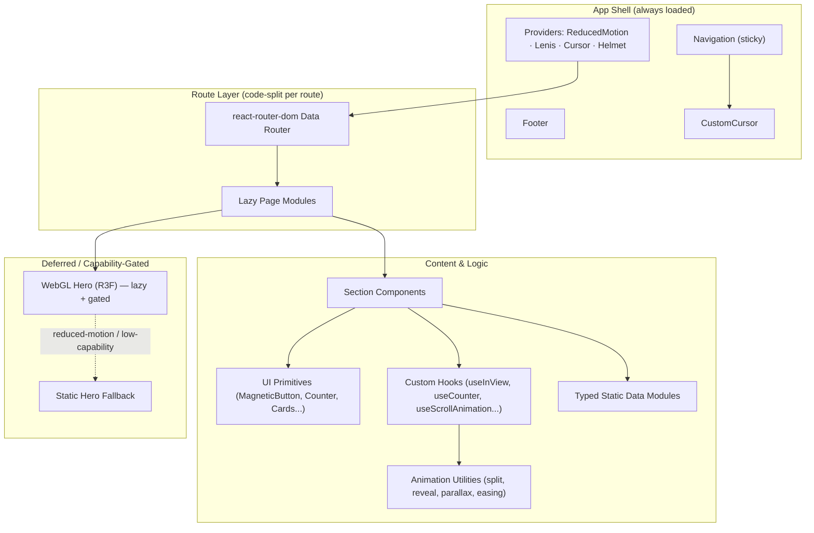
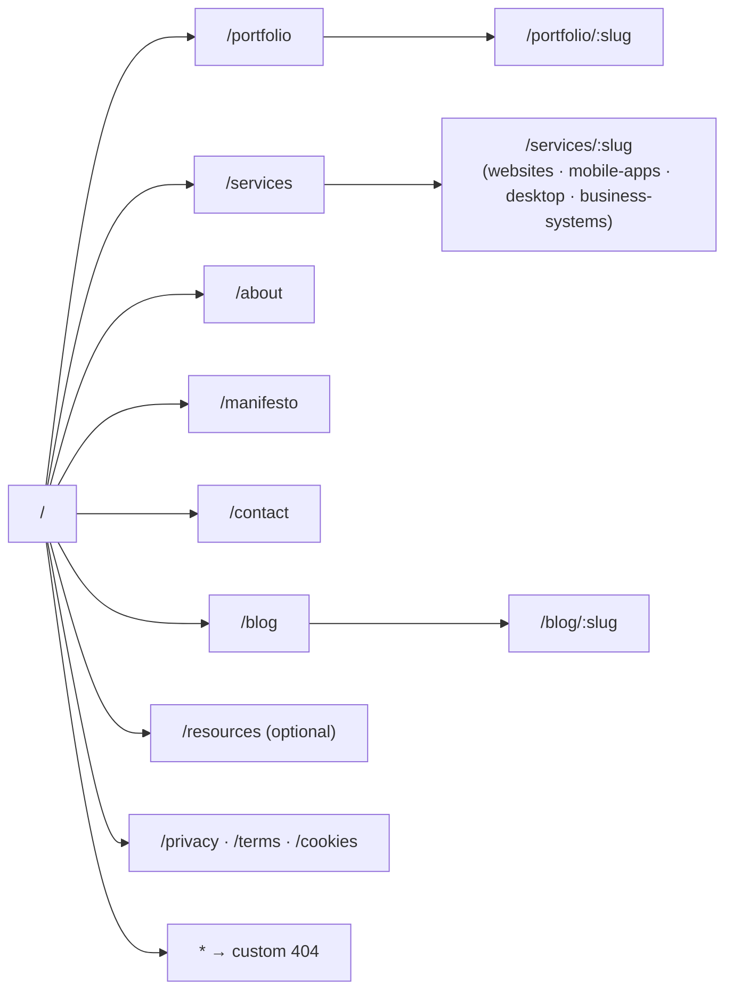
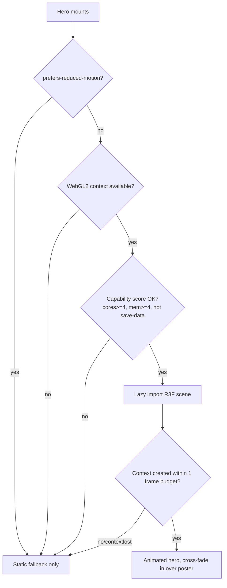

# Design Document: Ryze Technology Website

## Overview

Ryze Technology is a full-stack tech studio out of Nagpur that builds websites, web apps, mobile apps, desktop apps, and business systems & automation. The brand promise — **"We build products that work forever"** — is the gravitational center of the entire experience. This rebuild (v2) exists because v1 was judged too conservative for Awwwards: a flat CSS gradient, generic fade-ins, and no real point of view. This document defines a genuinely award-caliber front-end: a multi-page React + Vite + TypeScript site with a cohesive design language, scroll-driven storytelling, a signature WebGL hero, and a disciplined performance + accessibility budget so the spectacle never costs the experience.

### Creative Concept — "Engineered Permanence"

The concept is **Engineered Permanence**: software as something built, weighted, and durable — not disposable. The visual language borrows from industrial design and architecture rather than the usual "startup gradient" cliché. Three pillars carry the concept:

1. **The Grid as Foundation.** A visible baseline/column grid is a recurring motif — faint, monospaced coordinate labels, hairline rules, and "blueprint" registration marks. The grid reinforces "things that are built to last are built on structure." It is decorative *and* literal: layout snaps to it.

2. **Light on Dark Material.** The base is a deep, slightly desaturated navy-black (`ink`) treated as a physical material with subtle film-grain noise and a faint vignette, not a flat fill. Cyan (`pulse`) is used as *energy* — never as a wash, always as a deliberate signal: a cursor, a counter ticking, a line being drawn, a hover ignition. Restraint makes the cyan feel electric.

3. **Oversized Editorial Typography as Architecture.** Huge variable-font display headlines (clamped, fluid, occasionally set to the column grid and allowed to bleed off-canvas) act as structural elements. Per-line and per-word reveals make type feel constructed, assembled piece by piece — echoing the build metaphor.

The signature moment is the homepage hero: a WebGL field of instanced points/filaments that organize from chaotic noise into a stable lattice as the headline assembles — a literal visualization of "we make order that lasts." It degrades gracefully to a high-craft static/CSS treatment under `prefers-reduced-motion` or on weak hardware.

### What "Award-Caliber" Means Here (and the honest tension)

Awwwards juries reward **craft, concept, usability, and creativity** — not raw Lighthouse scores. Heavy motion and WebGL are in direct tension with a Lighthouse 100. We resolve this deliberately: the WebGL hero and smooth-scroll engine are **deferred, code-split, and capability-gated** so the *initial* paint and core content are fast and accessible, while the spectacle hydrates progressively. We target a realistic, defensible budget (see Performance Strategy) rather than pretending the tension does not exist.

---

## Key Technical Decisions

| Decision | Choice | Rationale | Trade-off / Mitigation |
|---|---|---|---|
| Framework | React 18 + Vite + TypeScript | Fast HMR, first-class code-splitting, strong typing for data-driven content | — |
| Styling | Tailwind CSS + CSS custom properties for tokens | Utility velocity + a single source of truth for design tokens that JS animation can also read | Token values mirrored into `tailwind.config.ts` and `:root` CSS vars |
| Routing | react-router-dom v6 (data router) | Multi-page, nested layouts, per-route code-splitting via `React.lazy` | SPA = needs static-host SPA fallback + prerender for SEO (see SEO) |
| Scroll storytelling | GSAP + ScrollTrigger | Industry standard for pinning, scrubbed timelines, counters; precise control | ~`gsap/ScrollTrigger` lazy-loaded; integrated with Lenis via a single RAF |
| Micro-interactions / transitions | Framer Motion | Declarative component + page transitions, layout animations, gestures | Used for UI-scale motion; GSAP owns scroll-scrubbed timelines (clear ownership boundary) |
| Smooth scroll | Lenis | Buttery virtual scroll that ScrollTrigger can drive; honors reduced-motion | Disabled entirely under reduced-motion; native scroll fallback |
| 3D / hero | @react-three/fiber + drei (lazy, optional) | Declarative Three.js in React; the signature visual | Hard-gated behind capability + reduced-motion checks; static fallback always shipped |
| Build / deploy | Static production build (Vite) to static hosting | Cheap, fast, CDN-friendly; matches "no dashboards/pricing" brief | Contact form posts to a separately hosted endpoint (env-configured URL) |
| SEO | `react-helmet-async` per route + build-time prerender of static routes | Per-route meta/OG/canonical; prerender for crawlers | Dynamic `:slug` routes prerendered from local typed data at build |
| Smooth scroll ↔ React | Custom `useLenis` + GSAP `ScrollTrigger.scrollerProxy` wiring | One RAF loop drives Lenis + ScrollTrigger; avoids competing scroll engines | Centralized in a single provider to prevent double-RAF bugs |
| Testing | Vitest + RTL + jest-axe + fast-check; Lighthouse CI smoke | PBT for pure logic, a11y assertions, perf regression guardrails | Visual/motion validated by example + integration tests, not PBT |

---

## Architecture

### High-Level Architecture

The app is a layered SPA. A thin **App shell** owns global providers (motion, smooth-scroll, cursor, helmet). A **route layer** lazy-loads page modules. Pages compose **sections**, which compose **primitives** and read from a **typed static data layer**. Animation is provided by **hooks + utilities** that are the *only* place that touches GSAP/Framer/Lenis directly, keeping components declarative and testable.



### Site Map (Routing)



### Route Table & Code-Splitting

Every route is a `React.lazy` import wrapped in a `<Suspense>` with a branded skeleton, so each page is its own chunk. Heavy, optional dependencies (R3F/Three, GSAP timelines for a specific page) are split *below* the route boundary so a page can render its content before its spectacle loads.

| Path | Page Module (lazy chunk) | Notable below-route splits |
|---|---|---|
| `/` | `HomePage` | `HeroWebGL` (R3F), `PortfolioPreview` GSAP timeline |
| `/portfolio` | `PortfolioListPage` | filter logic is sync (no split) |
| `/portfolio/:slug` | `CaseStudyPage` | `Lightbox`, results-counter timeline |
| `/services` | `ServicesPage` | process-step scroll timeline |
| `/services/:slug` | `ServiceDetailPage` | FAQ accordion, timeline |
| `/about` | `AboutPage` | stats-counter timeline |
| `/manifesto` | `ManifestoPage` | pinned belief sequence |
| `/contact` | `ContactPage` | form validation module |
| `/blog` | `BlogListPage` | pagination/filter (sync) |
| `/blog/:slug` | `BlogPostPage` | TOC scroll-spy, share |
| `/resources` | `ResourcesPage` | — |
| `/privacy`,`/terms`,`/cookies` | `LegalPage` (param-driven) | — |
| `*` | `NotFoundPage` | playful 404 canvas (lazy) |

### Rendering & Performance Strategy

The honest position: **we do not target Lighthouse 100 on the homepage**; we target a budget that keeps the site fast and accessible while preserving the signature experience. Concrete budget and tactics:

**Performance Budget (mid-tier mobile, throttled 4G):**

| Metric | Budget | How |
|---|---|---|
| LCP | ≤ 2.5s | LCP element is the hero *headline* (HTML/CSS text), not WebGL; fonts preloaded with `font-display: swap` + fallback metrics to avoid CLS |
| CLS | ≤ 0.02 | Reserved aspect-ratio boxes for all media; no layout-shifting font swap |
| INP | ≤ 200ms | Animation work off the main interaction path; RAF-batched; no synchronous layout thrash |
| TBT | ≤ 250ms | WebGL + GSAP deferred via `requestIdleCallback`/post-load; main thread free during boot |
| JS (initial route) | ≤ 180KB gzip | Code-split routes; Three/R3F never in the initial bundle |
| Lighthouse Perf (home, mobile) | ≥ 85 (target), with WebGL deferred | Spectacle hydrates after interactive |
| Lighthouse Perf (content pages) | ≥ 95 | Minimal JS, mostly static content |
| Lighthouse A11y / Best Practices / SEO | ≥ 95 | jest-axe in CI + semantic HTML + prerender |

**Loading strategy (in order):**
1. **Critical path:** HTML shell, critical CSS (inlined tokens + above-the-fold layout), hero headline text, nav. Renders and is readable immediately.
2. **Deferred enhancement:** After `load` + idle, dynamically import Lenis, GSAP/ScrollTrigger, and the cursor. Page is fully usable before these arrive (progressive enhancement, not dependency).
3. **Hero WebGL:** Dynamically imported only when `canRenderWebGL()` returns true (see Motion & Accessibility). Mounts behind an `<IntersectionObserver>` and a `prefers-reduced-motion` check. Static fallback paints first and is swapped (cross-faded) when ready.
4. **Below-fold media:** `loading="lazy"`, responsive `srcset`, modern formats (AVIF/WebP with fallback), explicit dimensions.
5. **Route prefetch:** On nav-link hover/focus (and via `requestIdleCallback`), prefetch the likely-next route chunk.

**Runtime tactics:** instancing for WebGL particles; cap `devicePixelRatio` at 2 for the canvas; pause the R3F render loop when the hero scrolls out of view or the tab is hidden; throttle pointer-driven effects with RAF; respect a global "motion budget" that downshifts effects on low-end devices (detected via `navigator.hardwareConcurrency`, `deviceMemory`, and a one-frame perf probe).

### Smooth Scroll + GSAP + React Integration

This is the highest-risk integration, so it is centralized in one provider to avoid the classic "two scroll engines fighting" and "double RAF" bugs.

```mermaid
sequenceDiagram
    participant App as App Shell
    participant SM as SmoothScrollProvider
    participant Lenis as Lenis
    participant GSAP as gsap.ticker / ScrollTrigger
    participant Page as Page Section

    App->>SM: mount (after idle, if motion allowed)
    SM->>SM: prefersReducedMotion? -> skip Lenis, use native scroll
    SM->>Lenis: new Lenis(opts)
    SM->>GSAP: ScrollTrigger.scrollerProxy(root, {lenis bindings})
    SM->>GSAP: gsap.ticker.add(time => lenis.raf(time*1000))
    SM->>GSAP: lenis.on('scroll', ScrollTrigger.update)
    Page->>GSAP: register ScrollTrigger timelines (via useScrollAnimation)
    Note over SM,GSAP: Single RAF source = gsap.ticker drives Lenis;<br/>ScrollTrigger updates on lenis scroll events
    App->>SM: route change -> ScrollTrigger.refresh() + scroll to top
    App->>SM: unmount -> destroy Lenis, kill all triggers, remove ticker
```

Rules enforced by the provider and hooks:
- **One RAF.** `gsap.ticker` is the single loop; Lenis is advanced from it. No component calls `requestAnimationFrame` for scroll directly.
- **Cleanup is mandatory.** Every `useScrollAnimation` returns its `ScrollTrigger`/timeline and kills it on unmount. On route change we `ScrollTrigger.refresh()` after the new page mounts and `gsap.context()`-scope all animations per page for bulk cleanup.
- **Reduced motion = no Lenis.** Under `prefers-reduced-motion`, Lenis is never instantiated, ScrollTriggers register with `scrub: false` and resolve instantly to their end state (content visible, no animation).

---

## Design System

All tokens live as CSS custom properties in `:root` (single source of truth) and are mirrored into `tailwind.config.ts` so utilities and JS animations read identical values.

### Color Tokens

The palette is a refined, material dark base with cyan as energy and a warm signal accent for contrast and warmth (so it never reads "cold corporate blue").

| Token | Value | Role |
|---|---|---|
| `--ink-900` | `#070A12` | Base material (page bg), near-black navy |
| `--ink-800` | `#0B1020` | Raised surfaces / cards |
| `--ink-700` | `#111A2E` | Hover surface / borders-on-dark |
| `--ink-600` | `#1C2640` | Subtle dividers |
| `--mist-300` | `#9FB0C9` | Secondary text on dark |
| `--mist-100` | `#E8EEF7` | Primary text on dark |
| `--pulse-500` | `#22D3EE` | Cyan — primary energy/accent |
| `--pulse-400` | `#5CE0F2` | Cyan hover/glow |
| `--pulse-700` | `#0E7490` | Cyan deep (gradients, focus rings) |
| `--ember-500` | `#FF7A45` | Warm signal accent (sparing: tags, emphasis) |
| `--lime-500` | `#B6FF3C` | Rare "success/live" accent (counters at rest → ignite) |
| `--grain` | url(noise.svg) @ 4% opacity | Film-grain material overlay |

Usage law: **cyan is a verb, not a background.** It appears on motion, focus, active counters, the cursor, and hairline draw-ins. Large fills stay in the `ink` family. Contrast pairs are pre-validated for WCAG AA: `--mist-100` on `--ink-900` ≈ 15:1; `--pulse-500` on `--ink-900` ≈ 9:1; body `--mist-300` on `--ink-900` ≈ 7:1.

### Typography

Two variable fonts. A bold grotesk display for editorial scale, a precise mono for the "engineered/blueprint" labels and metadata.

| Token | Family | Use |
|---|---|---|
| `--font-display` | "Clash Display" / "General Sans" variable (grotesk) | Oversized headlines, hero |
| `--font-sans` | "General Sans" / Inter variable | Body, UI |
| `--font-mono` | "JetBrains Mono" / "Space Mono" | Coordinate labels, tags, counters, eyebrows |

**Fluid type scale** (clamp, fluid between 360px and 1440px viewports), modular ratio ~1.25 body / aggressive jumps for display:

| Token | clamp() | Notes |
|---|---|---|
| `--fs-display-xl` | `clamp(3.5rem, 12vw, 11rem)` | Hero / section openers, can bleed off-canvas |
| `--fs-display-l` | `clamp(2.5rem, 7vw, 6rem)` | Page titles |
| `--fs-h2` | `clamp(2rem, 4vw, 3.5rem)` | Section headers |
| `--fs-h3` | `clamp(1.5rem, 2.5vw, 2.25rem)` | Subsections |
| `--fs-body-l` | `clamp(1.125rem, 1.4vw, 1.375rem)` | Lead paragraphs |
| `--fs-body` | `1rem`–`1.0625rem` | Body |
| `--fs-mono-eyebrow` | `0.8125rem`, tracked `0.16em`, uppercase | Eyebrows/labels |

Type rules: display headlines set tight (`line-height: 0.95`, negative tracking ~`-0.02em`); body comfortable (`1.6`); a hard `max-width: 68ch` on prose; per-line/word split reveals applied only to display & section openers (never body, for readability + a11y).

### Spacing & Layout Grid

8px base scale: `--space-1: 0.5rem` … `--space-16: 8rem`, plus section rhythm tokens `--section-y: clamp(5rem, 12vh, 12rem)`. A 12-column grid with `--gutter: clamp(1rem, 2vw, 2rem)` and `--margin: clamp(1.25rem, 6vw, 8rem)`; `max-width: 1600px`. The grid is occasionally *exposed* (hairline column overlay + monospaced coordinates) as the blueprint motif.

### Motion & Easing Tokens

| Token | Value | Use |
|---|---|---|
| `--ease-out-expo` | `cubic-bezier(0.16, 1, 0.3, 1)` | Reveals, entrances (signature easing) |
| `--ease-in-out-quint` | `cubic-bezier(0.83, 0, 0.17, 1)` | Page transitions, pinned scrubs |
| `--ease-out-back` | `cubic-bezier(0.34, 1.56, 0.64, 1)` | Magnetic/playful pops (sparing) |
| `--dur-fast` | `0.25s` | Micro hovers |
| `--dur-base` | `0.6s` | Standard reveals |
| `--dur-slow` | `1.1s` | Hero/headline assembly |
| `--stagger` | `0.06s` | Per-line/word/grid-item stagger |

Motion principles: everything eases *out* (decelerate into rest — "settling/permanence"); enter from a consistent direction (content rises + fades from 24px / clipPath reveal); stagger reads left-to-right, top-to-bottom; one hero moment per page (don't compete with yourself).

### Cursor States

A custom cursor (a small cyan dot + a lagging ring, GPU-transformed, RAF-lerped). Native cursor hidden only when the custom cursor is active and motion is allowed; otherwise native cursor is restored.

| State | Trigger | Appearance |
|---|---|---|
| `default` | idle | 6px dot + 32px ring, ring lags with lerp |
| `hover-link` | over interactive `[data-cursor="link"]` | ring scales to 48px, dot hides, mix-blend `difference` |
| `magnetic` | over `MagneticButton` | ring snaps to element bounds, dot pulses |
| `view` | over media `[data-cursor="view"]` | ring becomes a label pill ("VIEW", "DRAG", "OPEN") |
| `text` | over selectable prose | reverts to native I-beam |
| `hidden` | touch device / reduced-motion / leaves window | custom cursor unmounted, native restored |

---

## Motion & Accessibility Strategy

Accessibility is a first-class constraint, not a fallback. **Every** effect has a defined reduced-motion behavior, and the site is fully usable, readable, and navigable with zero animation.

### `prefers-reduced-motion` Matrix

| Effect | Full experience | Reduced-motion fallback |
|---|---|---|
| WebGL hero | Animated particle→lattice field, pointer parallax | Static rendered poster image / CSS gradient-mesh; no canvas mounted, no RAF |
| Smooth scroll (Lenis) | Virtual smooth scroll | Native scroll, Lenis never instantiated |
| Text split reveals | Per-line/word staggered rise | Text rendered fully visible instantly (no transform), split spans still semantically a single accessible string |
| Scroll-pinned sections | Pin + scrubbed timeline | No pin; sections flow normally, end-state styles applied |
| Parallax | Layers move at differing rates | Layers static at neutral position |
| Animated counters | Count up on enter | Final value rendered immediately |
| Marquee | Continuous translate | Static row, or paused; respects reduce-motion |
| Magnetic buttons / hover distortion | Pointer-follow transform | Standard hover color/scale only via CSS, no JS transform |
| Custom cursor | Active | Unmounted, native cursor |
| Page transitions | Animated clip/slide | Instant cross-fade ≤ 120ms or none (still scroll-to-top + focus mgmt) |
| Image reveals | clipPath wipe | Plain `loading=lazy` fade-in via CSS only |

Implementation: a single `useReducedMotion()` hook reads `matchMedia('(prefers-reduced-motion: reduce)')` and listens for changes; a `<ReducedMotionProvider>` exposes it via context so hooks/utilities branch consistently. GSAP uses `gsap.matchMedia()` so timelines are registered/torn down reactively when the preference changes.

### WebGL Capability Gating



### Core Accessibility Guarantees (WCAG 2.1 AA)

- **Semantics:** Landmark regions (`header`, `nav`, `main`, `footer`), one `h1` per page, ordered heading hierarchy, `<nav aria-label>` for each nav region.
- **Keyboard:** All interactive elements reachable and operable; visible focus ring (`--pulse-500` 2px offset) never removed; skip-to-content link; focus trap + restore for mobile menu and lightbox; `Esc` closes overlays.
- **Route changes:** On navigation, move focus to the new page's `<h1>` (or a `tabindex=-1` main wrapper) and announce via an `aria-live="polite"` route announcer; scroll to top.
- **Split text a11y:** Visual split into per-word/line spans must preserve a single readable accessible name — use `aria-label` on the wrapper and `aria-hidden` on decorative spans, or ensure spans concatenate to the original text without injected whitespace artifacts.
- **Media:** All images have meaningful `alt` (or `alt=""` if decorative); lightbox is a labeled `role="dialog"` with focus management; video/canvas has `aria-hidden` when purely decorative.
- **Forms:** Programmatic `<label>` association, `aria-invalid` + `aria-describedby` for errors, error summary focusable on submit, success/failure announced via live region.
- **Contrast & target size:** AA contrast verified per token pair; interactive targets ≥ 44×44px.
- **Marquees/auto-motion:** No content auto-moves longer than 5s without a pause mechanism; all auto-motion is disabled under reduced-motion.

---

## Per-Page Section Breakdowns

Each page follows the shell (sticky `Navigation`, `CustomCursor`, `Breadcrumb` on sub-pages, `Footer`) and renders inside a `PageTransition` wrapper. Each page has exactly one "hero moment" of heavy motion; subsequent sections use lighter reveals.

### 1. `/` — Homepage

| # | Section | Content & Motion |
|---|---|---|
| 1 | **Hero** | WebGL particle→lattice field; oversized headline "We build products that work forever" assembled per-word (`--dur-slow`); mono eyebrow with live coordinate label; scroll indicator. Fallback: static mesh poster + same text reveal as CSS. |
| 2 | **Problems** | "Software that rots" — a pinned horizontal-ish scroll of failure modes (broken handoffs, abandoned codebases, fragile automations) with split-text reveals; cyan strike-throughs draw in on scrub. |
| 3 | **Philosophy** | Large editorial statement of the "Engineered Permanence" belief; exposed grid overlay; parallax accent marks. |
| 4 | **Portfolio preview** | 3 featured `CaseStudyCard`s with hover image distortion + magnetic CTA; staggered reveal; "VIEW" cursor. |
| 5 | **Services** | 4 `ServiceCard`s (Websites, Mobile, Desktop, Systems/Automation) with line-draw icons; hover ignites cyan border. |
| 6 | **Why Us** | `AnimatedCounter` metrics row (projects shipped, years uptime, etc.) counting on scroll-in; differentiator list. |
| 7 | **Team** | 4 `TeamCard`s, marquee of names/roles, hover reveals portrait. |
| 8 | **CTA** | Oversized "Let's build something permanent" + `MagneticButton` to `/contact`. |
| 9 | **Footer** | Shared. |

### 2. `/portfolio` — Portfolio Listing
- **Hero**: page title + count; mono eyebrow.
- **Filter bar**: `All | Websites | Mobile | Systems` — animated active indicator (Framer `layoutId`); filtering is pure (`filterCaseStudies`), grid re-flows with `AnimatePresence` + layout animation.
- **Grid**: responsive `CaseStudyCard` grid, image reveal on scroll-in, hover distortion, "VIEW" cursor.
- **CTA**, **Footer**.

### 3. `/portfolio/:slug` — Case Study Detail
- **Breadcrumb** → **Hero** (project title, role, year, hero image with clip reveal).
- **Challenge** → **Solution** (alternating editorial layout, pinned media).
- **Results**: metric grid with `AnimatedCounter`s (e.g., "+212% performance").
- **Gallery / Lightbox** ("OPEN" cursor; keyboard-navigable dialog).
- **Testimonial** (`TestimonialCard`), **Technical breakdown** (tech stack chips), **Key learnings**, **Related projects** (`getRelatedCaseStudies`), **CTA**.
- Unknown slug → 404 (see Error Handling).

### 4. `/services` — Services Overview
- **Hero** → **4 service cards** → **Process steps** (pinned, numbered, scrubbed line connecting steps) → **Support/maintenance** band ("work forever" = maintenance promise) → **CTA**.

### 5. `/services/:slug` — Service Detail (`websites` · `mobile-apps` · `desktop` · `business-systems`)
- **Breadcrumb** → **Hero** → **What we do** → **Features** (staggered grid) → **Related case studies** (`getCaseStudiesByService`) → **Tech stack** → **Process / timeline** (scrubbed) → **FAQ** (accessible accordion) → **CTA**.

### 6. `/about`
- **Hero / story** → **Mission** → **Team profiles** (4 `TeamCard`s w/ social links) → **Differentiators** → **By-the-numbers** (`AnimatedCounter`s) → **Testimonials** (carousel/marquee) → **CTA**.

### 7. `/manifesto`
- **Hero** (oversized type) → **Core beliefs** (5–7, pinned sequential reveal, each belief fills viewport then releases) → **What we stand against** (inverted/high-contrast band) → **The Ryze promise** → **CTA**. The most type-forward, motion-restrained-but-bold page.

### 8. `/contact`
- **Hero** → **Form** (name, email, company, project type, budget, timeline, message) with inline validation, focus-driven field highlight, submit states (idle/submitting/success/error) → **Contact info** → **Scheduling CTA** → **Social links** → **FAQ**. Form posts to env-configured endpoint.

### 9. `/blog` — Listing
- **Hero** → **Category filter** (pure `filterPostsByCategory`) → **Card grid** (`BlogCard`: image, category, title, excerpt, date, reading time) → **Pagination** (pure `paginate`) → **CTA**.

### 10. `/blog/:slug` — Post
- **Breadcrumb** → **Hero** (title, category, date, reading time, author) → **TOC** (sticky scroll-spy) → **Content** (prose, max 68ch) → **Author bio** → **Related posts** (`getRelatedPosts`) → **Share buttons** → **CTA**.

### 11. `/resources` (optional)
- **Hero** → **Downloadable resource grid** (cards w/ file meta, download links) → **CTA**.

### 12. `/privacy` · `/terms` · `/cookies`
- Shared `LegalPage` template: **Breadcrumb** → typographic long-form with auto TOC → last-updated mono label. Minimal motion, maximum readability.

### 13. `*` — 404
- Playful: oversized "404" with a small interactive canvas (lazy), witty copy, quick links to top routes, and search/back-home `MagneticButton`. Reduced-motion: static.

---

## Data Models

All content is centralized, typed, static data (no runtime CMS). Modules: `caseStudies.ts`, `services.ts`, `team.ts`, `blogPosts.ts`, `testimonials.ts`, `navigation.ts`, `siteMetadata.ts`. Slugs are unique within their collection (enforced by a dev-time assertion + a PBT-able invariant).

```typescript
// ---------- Shared primitives ----------
export type Slug = string;            // kebab-case, unique within a collection
export type ISODate = string;         // 'YYYY-MM-DD'
export type ServiceKey = 'websites' | 'mobile-apps' | 'desktop' | 'business-systems';
export type PortfolioCategory = 'websites' | 'mobile' | 'systems';
export type BlogCategory = 'engineering' | 'design' | 'process' | 'company';

export interface ImageAsset {
  src: string;
  srcset?: string;
  width: number;        // intrinsic, used to reserve aspect ratio (no CLS)
  height: number;
  alt: string;          // '' if purely decorative
  blurDataURL?: string; // LQIP placeholder
}

export interface SEOMeta {
  title: string;
  description: string;  // normalized to <=160 chars (see normalizeMetaDescription)
  canonical: string;    // absolute URL
  ogImage?: ImageAsset;
  noIndex?: boolean;
}

export interface Metric {
  label: string;        // "Performance gain"
  value: number;        // 212  (numeric target for counter)
  suffix?: string;      // "%", "x", "+"
  prefix?: string;      // "$", "+"
  decimals?: number;    // 0 by default
}

// ---------- Case Study ----------
export interface CaseStudy {
  slug: Slug;
  title: string;
  client: string;
  category: PortfolioCategory;
  services: ServiceKey[];           // which services this project used
  year: number;
  role: string;                     // "Design + Full-stack"
  featured: boolean;                // surfaces on homepage preview
  order: number;                    // manual sort weight
  summary: string;
  hero: ImageAsset;
  challenge: string;
  solution: string;
  results: Metric[];
  gallery: ImageAsset[];
  testimonialId?: string;           // -> Testimonial.id
  techStack: string[];
  learnings: string[];
  relatedSlugs?: Slug[];            // explicit overrides; else computed
  seo: SEOMeta;
}

// ---------- Service ----------
export interface ProcessStep {
  index: number;        // 1-based, must be contiguous & ordered
  title: string;
  description: string;
}
export interface FAQItem { question: string; answer: string; }

export interface Service {
  slug: ServiceKey;
  name: string;                     // "Websites & Web Apps"
  tagline: string;
  icon: string;                     // icon key for line-draw SVG
  order: number;
  summary: string;
  whatWeDo: string;
  features: { title: string; description: string }[];
  techStack: string[];
  process: ProcessStep[];
  faqs: FAQItem[];
  relatedCaseStudySlugs?: Slug[];   // else computed via services[] match
  seo: SEOMeta;
}

// ---------- Team ----------
export interface SocialLink { platform: 'github' | 'linkedin' | 'x' | 'dribbble' | 'email'; url: string; }
export interface TeamMember {
  id: string;
  name: string;
  role: string;
  bio: string;
  portrait: ImageAsset;
  socials: SocialLink[];
  order: number;
}

// ---------- Blog ----------
export interface BlogAuthor { id: string; name: string; role: string; avatar: ImageAsset; }
export interface BlogPost {
  slug: Slug;
  title: string;
  category: BlogCategory;
  excerpt: string;
  cover: ImageAsset;
  content: string;                  // markdown/MDX source
  author: BlogAuthor;
  publishedAt: ISODate;
  updatedAt?: ISODate;
  readingTimeMinutes: number;       // precomputed via computeReadingTime(content)
  tags: string[];
  featured?: boolean;
  relatedSlugs?: Slug[];
  seo: SEOMeta;
}

// ---------- Testimonial ----------
export interface Testimonial {
  id: string;
  quote: string;
  author: string;
  authorRole: string;
  company: string;
  avatar?: ImageAsset;
  caseStudySlug?: Slug;
  rating?: number;                  // 1..5 optional
}

// ---------- Navigation ----------
export interface NavChild { label: string; path: string; description?: string; }
export interface NavItem {
  label: string;
  path?: string;                    // present if not a pure dropdown parent
  children?: NavChild[];            // dropdown (Work, Services, About)
  cta?: boolean;                    // renders as MagneticButton (Contact)
}

// ---------- Site Metadata ----------
export interface SiteMetadata {
  siteName: string;
  defaultTitle: string;
  titleTemplate: string;            // "%s — Ryze Technology"
  defaultDescription: string;
  baseUrl: string;                  // for canonical/OG
  defaultOgImage: ImageAsset;
  social: SocialLink[];
  contactEmail: string;
  contactEndpoint: string;          // form POST target (env-injected)
}
```

---

## Components and Interfaces

> Low-level signatures for every component and hook in the system.

### Providers & Shell

```typescript
// Single source of truth for motion preference; listens for live changes.
function ReducedMotionProvider(props: { children: ReactNode }): JSX.Element;
function useReducedMotion(): boolean;

// Owns Lenis + GSAP ticker wiring; no-ops under reduced motion. One per app.
function SmoothScrollProvider(props: {
  children: ReactNode;
  options?: Partial<LenisOptions>;
}): JSX.Element;
function useLenis(): { lenis: Lenis | null; scrollTo: (target: number | string | HTMLElement, opts?: ScrollToOptions) => void; stop: () => void; start: () => void };

// Custom cursor; mounts only on fine-pointer + motion-allowed.
function CustomCursor(): JSX.Element | null;

// Per-route SEO/meta via react-helmet-async.
function SEOHead(props: { meta: SEOMeta; jsonLd?: object }): JSX.Element;

// Wraps each route; animates enter/exit, scrolls to top, manages focus + aria-live.
function PageTransition(props: { children: ReactNode; routeKey: string }): JSX.Element;

interface ScrollToOptions { offset?: number; duration?: number; immediate?: boolean; }
```

### Navigation & Layout

```typescript
function Navigation(props: { items: NavItem[]; transparentUntilScroll?: boolean }): JSX.Element;
function Footer(props: { metadata: SiteMetadata }): JSX.Element;
function Breadcrumb(props: { trail: { label: string; path?: string }[] }): JSX.Element;
function ScrollIndicator(props: { targetId?: string }): JSX.Element;
function SectionHeader(props: { eyebrow?: string; title: string; align?: 'left' | 'center'; as?: 'h1' | 'h2' }): JSX.Element;
```

### Animation Wrappers & Primitives

```typescript
// Declarative reveal wrapper; uses IntersectionObserver; instant-visible under reduced motion.
function AnimationWrapper(props: {
  children: ReactNode;
  variant?: 'rise' | 'fade' | 'clip' | 'scale';
  delay?: number;          // seconds
  stagger?: number;        // applied to direct children
  once?: boolean;          // default true
  threshold?: number;      // default 0.2
}): JSX.Element;

// Splits text into accessible word/line spans for staggered reveal.
function SplitText(props: {
  text: string;
  by?: 'word' | 'line' | 'char';   // default 'word'
  as?: keyof JSX.IntrinsicElements; // default 'span'
  className?: string;
  trigger?: 'inview' | 'mount';
}): JSX.Element;   // wrapper carries aria-label=text; spans aria-hidden

// Pointer-follow magnetic interactive; falls back to CSS hover under reduced motion.
function MagneticButton(props: {
  children: ReactNode;
  as?: 'button' | 'a';
  href?: string;
  onClick?: () => void;
  strength?: number;       // 0..1, default 0.35
  ariaLabel?: string;
}): JSX.Element;

// Counts from 0 (or `from`) to `value` when scrolled into view.
function AnimatedCounter(props: {
  value: number;
  from?: number;           // default 0
  duration?: number;       // seconds, default 2
  decimals?: number;       // default 0
  prefix?: string;
  suffix?: string;
  easing?: EasingFn;       // default easeOutExpo
}): JSX.Element;

function MarqueeText(props: {
  items: string[];
  speed?: number;          // px/sec, default 60
  direction?: 'left' | 'right';
  pauseOnHover?: boolean;  // default true
  separator?: ReactNode;
}): JSX.Element;

function Lightbox(props: {
  images: ImageAsset[];
  index: number;
  open: boolean;
  onClose: () => void;
  onIndexChange: (i: number) => void;  // clamps/wraps via wrapIndex
}): JSX.Element;
```

### Cards & Content

```typescript
function CaseStudyCard(props: { caseStudy: CaseStudy; index?: number; featured?: boolean }): JSX.Element;
function ServiceCard(props: { service: Service; index?: number }): JSX.Element;
function TeamCard(props: { member: TeamMember; index?: number }): JSX.Element;
function BlogCard(props: { post: BlogPost; index?: number }): JSX.Element;
function TestimonialCard(props: { testimonial: Testimonial }): JSX.Element;
function CTA(props: { heading: string; sub?: string; href?: string; label?: string }): JSX.Element;
```

### Hero (WebGL + Fallback)

```typescript
// Decides WebGL vs fallback; lazy-imports the R3F scene only when allowed.
function Hero(props: { headline: string; eyebrow?: string }): JSX.Element;

// Lazily-loaded; never in initial bundle.
const HeroWebGL: React.LazyExoticComponent<React.FC<{ paused: boolean }>>;
function HeroFallback(props: { poster?: ImageAsset }): JSX.Element;

// Capability gate used by Hero.
function canRenderWebGL(opts?: { minCores?: number; minMemoryGB?: number }): boolean;
```

### Custom Hooks

```typescript
// IntersectionObserver wrapper.
function useInView<T extends Element>(options?: {
  threshold?: number; rootMargin?: string; once?: boolean;
}): { ref: RefObject<T>; inView: boolean };

// Tween a numeric value with easing + clamping; reduced-motion returns target instantly.
function useCounter(target: number, opts?: {
  from?: number; duration?: number; easing?: EasingFn; start?: boolean; decimals?: number;
}): number;

// Registers a GSAP timeline/ScrollTrigger scoped to the component; auto-cleanup.
function useScrollAnimation(
  setup: (ctx: { el: HTMLElement; gsap: GSAP; ScrollTrigger: typeof ScrollTrigger; reducedMotion: boolean }) => void,
  deps?: DependencyList
): RefObject<HTMLElement>;

function useReducedMotion(): boolean; // (re-exported from provider)

// Maps width -> semantic category; single source of breakpoints.
type ViewportCategory = 'mobile' | 'tablet' | 'desktop' | 'wide';
function useViewportCategory(): ViewportCategory;

function useSmoothScroll(): ReturnType<typeof useLenis>; // alias

// Magnetic pointer transform values for an element.
function useMagnetic(strength?: number): {
  ref: RefObject<HTMLElement>; x: MotionValue<number>; y: MotionValue<number>;
};
```

---

## Animation Utility Signatures

Pure-ish helpers that hooks/components call. The numeric helpers (easing, clamp, interpolate, reading time, pagination, filtering, slug resolution, meta normalization, viewport category) are **pure and the target of property-based testing**. The GSAP/DOM helpers are thin imperative wrappers validated by example/integration tests.

```typescript
// ---- Pure numeric / logic helpers (PBT targets) ----
type EasingFn = (t: number) => number; // domain & range conceptually [0,1]

const easeOutExpo: EasingFn;
const easeInOutQuint: EasingFn;
const easeOutBack: EasingFn;            // may overshoot range (documented)

function clamp(value: number, min: number, max: number): number;
function lerp(a: number, b: number, t: number): number;          // t clamped to [0,1]
function interpolateCounter(from: number, to: number, progress: number, easing: EasingFn, decimals: number): number;
function mapRange(v: number, inMin: number, inMax: number, outMin: number, outMax: number, clampOut?: boolean): number;

function computeReadingTime(content: string, wordsPerMinute?: number): number;     // default 225 wpm, min 1
function normalizeMetaDescription(input: string, maxLen?: number): string;          // default 160, trims, no mid-word cut, ellipsis
function resolveBySlug<T extends { slug: string }>(items: T[], slug: string): T | undefined;
function uniqueSlugs<T extends { slug: string }>(items: T[]): boolean;              // invariant check

function filterCaseStudies(items: CaseStudy[], category: PortfolioCategory | 'all'): CaseStudy[];
function getCaseStudiesByService(items: CaseStudy[], service: ServiceKey): CaseStudy[];
function getRelatedCaseStudies(all: CaseStudy[], current: CaseStudy, limit?: number): CaseStudy[];
function filterPostsByCategory(posts: BlogPost[], category: BlogCategory | 'all'): BlogPost[];
function getRelatedPosts(all: BlogPost[], current: BlogPost, limit?: number): BlogPost[];

interface PageResult<T> { items: T[]; page: number; totalPages: number; hasPrev: boolean; hasNext: boolean; total: number; }
function paginate<T>(items: T[], page: number, perPage: number): PageResult<T>;     // page clamped to [1,totalPages]
function wrapIndex(index: number, length: number): number;                          // for lightbox/carousel wrap-around
function viewportCategory(width: number): ViewportCategory;                         // pure mapping used by hook

function buildBreadcrumbTrail(pathname: string, labelMap: Record<string, string>): { label: string; path?: string }[];

// ---- Imperative GSAP/DOM wrappers (example/integration tested) ----
function revealOnScroll(el: HTMLElement, opts: { variant: string; reducedMotion: boolean }): ScrollTrigger | undefined;
function pinSection(el: HTMLElement, opts: { end: string; scrub: boolean | number; reducedMotion: boolean }): ScrollTrigger | undefined;
function parallaxLayer(el: HTMLElement, opts: { speed: number; reducedMotion: boolean }): ScrollTrigger | undefined;
function applySplit(el: HTMLElement, by: 'word' | 'line' | 'char'): { spans: HTMLElement[]; revert: () => void };
function hoverDistort(el: HTMLElement, opts: { intensity: number }): () => void;     // returns cleanup
```

---

## Error Handling

| Scenario | Condition | Response | Recovery |
|---|---|---|---|
| Route not found | URL matches no route | Render `NotFoundPage` (404) with quick links + status meta `noIndex` | User navigates via links/back home |
| Entity slug not found | `/portfolio/:slug`, `/services/:slug`, `/blog/:slug` resolves to `undefined` | Redirect/render in-route 404 state with related suggestions; `resolveBySlug` returns undefined → guard renders not-found | Suggest nearest/related entities |
| Image load failure | `` `onError` | Swap to `blurDataURL`/solid token placeholder + retain reserved aspect box (no CLS); decorative ones get `alt=""` | Optional one-time retry with cache-bust |
| Lightbox open failure | image array empty or index OOB | `wrapIndex` clamps; if empty, lightbox refuses to open (no-op) | Close + toast (polite live region) |
| Form validation error | client-side schema fails | Inline field errors, `aria-invalid`, focus error summary; submit blocked | User corrects; live region announces count |
| Form submit network error | POST to endpoint fails / non-2xx / timeout | Error state with retry button; preserve entered values; announce failure | Manual retry; fallback `mailto:` contact shown |
| Form submit success | 2xx | Success state, clear form, polite live announcement | — |
| WebGL unsupported / low capability | `canRenderWebGL()` false | Never mount canvas; render `HeroFallback` | — (this is the designed path) |
| WebGL context lost | `webglcontextlost` event | Pause loop, dispose scene, swap to `HeroFallback` | Attempt single re-init on `webglcontextrestored`; else stay on fallback |
| Reduced-motion preference | media query true (incl. mid-session change) | All effects resolve to end-state; Lenis/cursor/canvas not mounted | Re-enables live if user changes preference (gsap.matchMedia) |
| Smooth-scroll init failure | Lenis throws | Catch, fall back to native scroll, `ScrollTrigger` uses default scroller | Site fully functional natively |
| Chunk load failure | lazy import rejects (network) | Error boundary with retry; reload route chunk | Retry button re-imports |
| Data integrity (dev) | duplicate slugs / non-contiguous process steps | Dev-time assertion throws in build/test; PBT invariants catch in CI | Fix data before ship |

A top-level `ErrorBoundary` wraps the router; a per-route boundary wraps `Suspense` so one failed chunk never blanks the whole app.

---

## Correctness Properties

> Property-based testing targets for the pure logic layer.

These properties target the **pure logic layer** and are expressed for `fast-check`. Each notes what it validates. Visual, motion, and performance behavior are explicitly *out of scope* for PBT and covered by example/integration/smoke tests.

### Easing & Interpolation

### Property 1: Easing endpoints

∀ easing fn `f` in {easeOutExpo, easeInOutQuint}: `f(0) ≈ 0` and `f(1) ≈ 1`. *Validates counters/reveals start and end exactly at bounds.*

### Property 2: Easing monotonicity (non-overshoot fns)

∀ `t1 < t2` in [0,1]: `easeOutExpo(t1) ≤ easeOutExpo(t2)`. *Counters never visually move backward.* (easeOutBack exempt; documented overshoot.)

### Property 3: clamp bounds

∀ `v, min ≤ max`: `min ≤ clamp(v,min,max) ≤ max`, and if `min ≤ v ≤ max` then result `= v`. *No counter/scroll value escapes its range.*

### Property 4: lerp endpoints & bounds

∀ `a,b`: `lerp(a,b,0)=a`, `lerp(a,b,1)=b`; ∀ `t∈[0,1]` result lies within `[min(a,b), max(a,b)]`. *Cursor lerp and transitions stay between source and target.*

### Property 5: mapRange invertibility

∀ valid ranges, mapping `v` then mapping back yields ≈ `v` (within ε). *Parallax/scroll progress mapping is consistent.*

### Property 6: interpolateCounter clamping & rounding

∀ `progress∈[0,1]`, result is between `from` and `to`, and rounded to exactly `decimals` places; `progress≤0 ⇒ from`, `progress≥1 ⇒ to`. *Animated counters land precisely on the target.*

### Reading Time

### Property 7: Positivity

∀ non-empty `content`: `computeReadingTime(content) ≥ 1`. *Never show "0 min read".*

### Property 8: Monotonic in length

∀ contents `a`, `b` with wordcount(a) ≤ wordcount(b): `readingTime(a) ≤ readingTime(b)`. *More words never reads faster.*

### Property 9: Whitespace invariance

Collapsing arbitrary runs of whitespace does not change reading time. *Formatting/markdown spacing doesn't skew the estimate.*

### Property 10: Scaling

Doubling word count (same wpm) yields ≈ double minutes (within rounding). *Estimate is proportional.*

### Meta Description Normalization

### Property 11: Length bound

∀ input, `normalizeMetaDescription(input).length ≤ maxLen` (default 160). *OG/meta never truncated by crawlers unexpectedly.*

### Property 12: Idempotence

`normalize(normalize(x)) = normalize(x)`. *Re-processing is stable.*

### Property 13: No mid-word cut

Output (minus any ellipsis) never ends in a partial word when input had a word boundary before maxLen. *Clean, readable snippets.*

### Property 14: Preservation when short

If `input` (trimmed) ≤ maxLen, output equals trimmed input (no ellipsis added). *Short descriptions pass through untouched.*

### Slug Resolution & Data Integrity

### Property 15: Round-trip resolution

∀ item `x` in a collection with unique slugs: `resolveBySlug(items, x.slug) === x`. *Detail pages always resolve their entity.*

### Property 16: Unknown slug

∀ slug not present: `resolveBySlug` returns `undefined` (never throws, never wrong entity). *Triggers 404 path safely.*

### Property 17: Slug uniqueness invariant

For each shipped collection, `uniqueSlugs(items) === true`. *Guards against ambiguous routes.*

### Property 18: Process-step contiguity

∀ service: `process` indices are `1..n` contiguous and strictly increasing. *Timeline renders without gaps.*

### Filtering (Portfolio & Blog)

### Property 19: Subset

∀ category: `filterCaseStudies(items, c) ⊆ items`. *Filtering never invents items.*

### Property 20: Predicate soundness

Every item in `filterCaseStudies(items, c)` (c≠'all') has `category === c`; none outside the result match. *Filter shows exactly the right items.*

### Property 21: 'all' identity (as set)

`filterCaseStudies(items,'all')` contains exactly the same elements as `items`. *The "All" tab shows everything.*

### Property 22: Order stability

Filtering preserves the relative order of the input. *No surprising reshuffles on filter change.*

### Property 23: Partition completeness

Union of results over all concrete categories equals the set of all items (each item appears in exactly its category). *No item is unreachable by any filter.*

### Property 24: Blog filter parity

Properties 19–23 hold analogously for `filterPostsByCategory`.

### Related Entities

### Property 25: Related excludes self & respects limit

`getRelatedCaseStudies(all, x, n)` never contains `x` and has length `≤ n`. *No self-reference; bounded rows.* (Same for `getRelatedPosts`.)

### Property 26: Related relevance

Every returned related case study shares ≥1 `service` (or category) with `current` when any such candidate exists. *Related means related.*

### Pagination

### Property 27: Page bounds

∀ `page`, `perPage≥1`: result `.page ∈ [1, totalPages]` (input clamped). *No empty/negative pages.*

### Property 28: Coverage / no loss

Concatenating `paginate(items,p,per).items` over `p=1..totalPages` equals `items` in order, with no duplicates or omissions. *Every item is reachable on exactly one page.*

### Property 29: Page size

Every page except possibly the last has exactly `perPage` items; the last has `1..perPage`. *Consistent grid fill.*

### Property 30: Flag correctness

`hasPrev === (page>1)`, `hasNext === (page<totalPages)`. *Prev/Next buttons enable correctly.*

### Property 31: totalPages formula

`totalPages === max(1, ceil(total/perPage))`. *Empty collections still yield one (empty) page.*

### Index Wrapping (Lightbox/Carousel)

### Property 32: In-range

∀ `length≥1`, ∀ integer `index`: `0 ≤ wrapIndex(index,length) < length`. *Lightbox nav never goes out of bounds.*

### Property 33: Wrap continuity

`wrapIndex(length, length)===0` and `wrapIndex(-1, length)===length-1`. *Next-from-last wraps to first; prev-from-first wraps to last.*

### Property 34: Identity in range

∀ `0 ≤ i < length`: `wrapIndex(i,length)===i`. *Normal navigation is unaffected.*

### Viewport Category

### Property 35: Totality & determinism

∀ `width ≥ 0`: `viewportCategory(width)` returns exactly one of the defined categories. *Layout always has a defined mode.*

### Property 36: Monotonic boundaries

Categories are ordered by width with no overlap or gap; increasing width never moves to a "smaller" category. *Breakpoints are consistent; no flicker at edges.*

### Breadcrumbs

### Property 37: Trail consistency

`buildBreadcrumbTrail(pathname,...)` starts at Home, segments are in path order, only the last item may omit a `path`, and the count equals the number of meaningful path segments + 1. *Breadcrumbs always reflect location accurately.*

---

## Testing Strategy

### Layers

| Layer | Tooling | Scope |
|---|---|---|
| **Property-based** | Vitest + fast-check | Pure logic layer: P1–P37 above (easing, counters, reading time, meta normalization, slug resolution, filtering, related, pagination, index wrap, viewport, breadcrumbs, data invariants) |
| **Unit / example** | Vitest + RTL | Component rendering, props → output, edge cases not suited to PBT (specific copy, formatting) |
| **Integration** | Vitest + RTL + user-event | Filtering UI updates grid, pagination controls, form validation + submit states (mocked endpoint), lightbox open/close/keyboard, mobile menu focus trap, route transitions + focus management |
| **Accessibility** | jest-axe (per page/section) + manual keyboard/SR pass | Zero axe violations on every page; focus order, labels, live regions, reduced-motion rendering |
| **Reduced-motion** | Vitest with mocked `matchMedia` | Assert end-state rendering, no Lenis/canvas/cursor mount, counters show final value |
| **Performance / smoke** | Lighthouse CI + Vite build smoke | Build succeeds; bundle-size budget assertions (initial route ≤ 180KB gzip, Three not in initial chunk); Lighthouse thresholds per route table |
| **Visual (optional)** | Playwright screenshots | Catch layout regressions on key pages (motion disabled for determinism) |

### Principles & Boundaries

- **PBT is for the pure logic layer only.** Animation timing, WebGL output, scroll feel, and visual polish are inherently non-deterministic / perceptual — they are validated by example tests, integration tests, manual review, and Lighthouse smoke tests, **not** property-based tests.
- **Determinism for tests:** all animation code branches on `useReducedMotion`; tests force reduced-motion so DOM assertions are stable and instant.
- **A11y is a gate:** CI fails on any jest-axe violation. WCAG AA contrast checked against tokens.
- **Performance is a gate:** CI fails if the initial route bundle exceeds budget or if `three`/`@react-three/fiber` appears in the entry chunk.
- **Data invariants run in CI:** P17 (unique slugs) and P18 (contiguous process steps) run against the real shipped data modules, not just generated input, so bad content fails the build.
- **fast-check config:** seeded runs in CI for reproducibility; counterexamples logged and pinned as regression example tests when found.

### Suggested test file layout

```
src/
  lib/__tests__/easing.prop.test.ts          // P1–P6
  lib/__tests__/readingTime.prop.test.ts      // P7–P10
  lib/__tests__/seo.prop.test.ts              // P11–P14
  lib/__tests__/slug.prop.test.ts             // P15–P18
  lib/__tests__/filter.prop.test.ts           // P19–P24
  lib/__tests__/related.prop.test.ts          // P25–P26
  lib/__tests__/paginate.prop.test.ts         // P27–P31
  lib/__tests__/wrapIndex.prop.test.ts        // P32–P34
  lib/__tests__/viewport.prop.test.ts         // P35–P36
  lib/__tests__/breadcrumb.prop.test.ts       // P37
  data/__tests__/integrity.test.ts            // P17, P18 vs real data
  components/**/__tests__/*.test.tsx           // RTL + jest-axe
  e2e/*.spec.ts                                // Playwright (optional)
```

---

## Dependencies

| Package | Purpose |
|---|---|
| `react`, `react-dom` | UI runtime |
| `vite`, `@vitejs/plugin-react` | Build/dev |
| `typescript` | Types |
| `tailwindcss`, `postcss`, `autoprefixer` | Styling |
| `react-router-dom` | Routing |
| `gsap` (+ ScrollTrigger) | Scroll storytelling, pinning, counters |
| `framer-motion` | Component/page transitions, micro-interactions |
| `lenis` | Smooth scrolling |
| `@react-three/fiber`, `@react-three/drei`, `three` | Optional WebGL hero (lazy, gated) |
| `react-helmet-async` | Per-route SEO/meta |
| `vitest`, `@testing-library/react`, `@testing-library/user-event` | Tests |
| `jest-axe` | Accessibility assertions |
| `fast-check` | Property-based testing |
| `@lhci/cli` | Lighthouse CI smoke tests |
| `vite-plugin-prerender` (or equivalent SSG step) | Build-time prerender of static + slug routes for SEO |
| `playwright` (optional) | Visual/E2E regression |

### Build & Deploy Notes

- Static Vite build (`vite build`) → deploy `dist/` to any static host (Netlify/Vercel/S3+CloudFront/GitHub Pages) with an SPA fallback (`/* → /index.html`) plus prerendered HTML for crawlable routes.
- Generate `sitemap.xml` and `robots.txt` at build from the route table + typed data slugs.
- Contact form posts to `siteMetadata.contactEndpoint` (env-injected, e.g. a serverless function or form service); the static site holds no secrets.
- Fonts self-hosted (`woff2`, variable), preloaded, with fallback metric overrides to prevent CLS.
